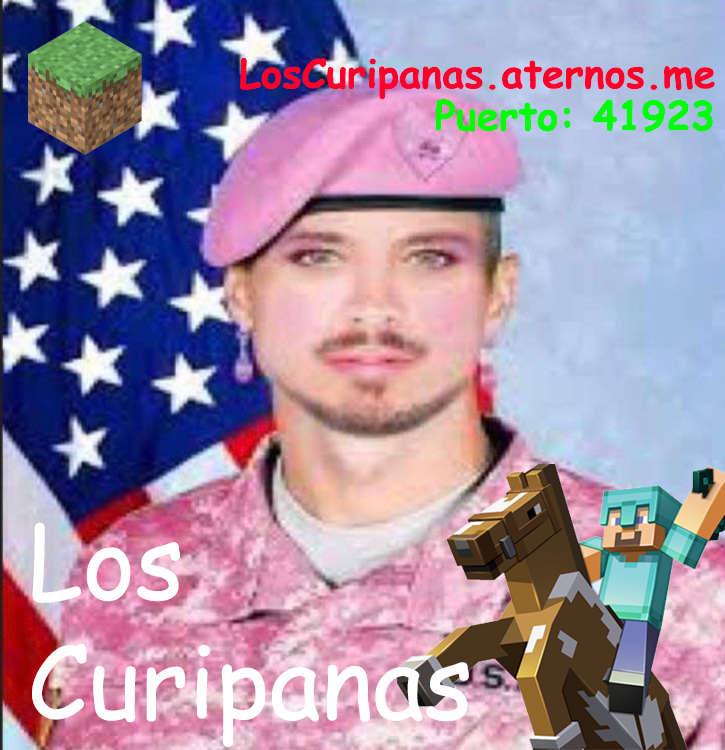

<h1>Los Curipanas: Servidor Oficial de Minecraft</h1>

<h2>Tabla de Contenido</h2>

- [Sobre el servidor](#sobre-el-servidor)
  - [Grupo WhatsApp](#grupo-whatsapp)
- [Plugins](#plugins)
  - [Mochilas](#mochilas)
    - [Guía del Usuario](#guía-del-usuario)
  - [GeyserMC](#geysermc)
- [Licencia](#licencia)

## Sobre el servidor

Servidor de Minecraft hosteado en [Aternos](https://aternos.org). Compatible con versiones **Java** y **Bedrock**. 

Version **1.19.4**

Usuarios con Minecraft crackeado tambien pueden unirse.

### Grupo WhatsApp

Para unirse al grupo oficial de **Los Curipanas**, haz click en el siguiente link de invitación de WhatsApp:

[https://chat.whatsapp.com/JjiZBVQRCQx0sdnkEQeEND](https://chat.whatsapp.com/JjiZBVQRCQx0sdnkEQeEND)

## Plugins

Lista de plugins actuales:

- [Mochilas](#mochilas)
- [GeyserMc](#geysermc)

---

### Mochilas

Link del plugin: [https://www.curseforge.com/minecraft/bukkit-plugins/backpack-item](https://www.curseforge.com/minecraft/bukkit-plugins/backpack-item)

Este plugin permite que tanto los usuarios de Java como los de Bedrock puedan usar mochilas sin necesidad de instalar nada.

#### Guía del Usuario

Para leer más sobre como utilizar las mochilas en el juego, haga click [aquí](GUIA_MOCHILAS.md).

---

### GeyserMC

Link del plugin: [https://geysermc.org/](https://geysermc.org/)

Plugin para habilitar compatibilidad entre jugadores de Bedrock con los de Java. Sin este, el servidor no sería compatible con las dos versiones.

## Licencia

Para leer más sobre la licencia, haga click [aquí](LICENSE.md).